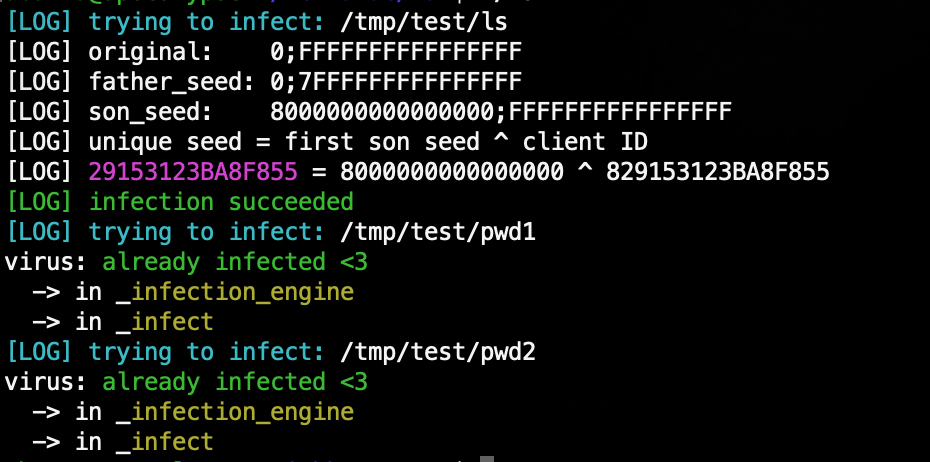
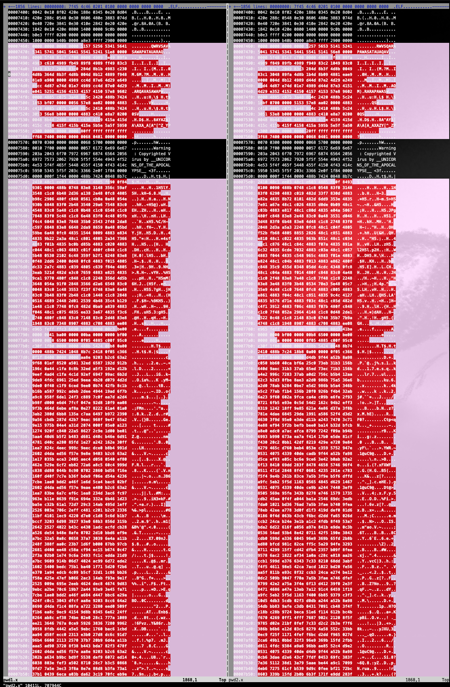

# War

A polymorphic Virus for Elf64 binaries

## Installation

This might trigger your anti-virus, which is normal. Use at your own risk!

```bash
# clone it
git clone https://github.com/spolowy/War.git && cd War
# build it and run it
make && ./war
# remove installation files
cd .. && rm -rf War
```

## Features

Play around with the colourful debug mode!



```bash
# to build it in debug mode
make debug
```

Test or benchmark the virus polymorphism with:

```bash
# wander into tests directory
cd tests
# run tests or benchmark (with optional debug arg)
./test.bash
./vimdiff.bash
```



## Insides

* Featuring a generated polymorphic loader
* And a virus body encrypted with a polymorphic seed

```
  Infected program memory overview
  ================================

                          .        .
                          |  ...   |
              p_offset -> |========| PT_LOAD  - relative_pt_load_address
                          |  ...   |          ^
                          |  ...   |          |
             sh_offset -> |--------|          |
                      |   |  ...   |          |
                      V   |  ...   |          |
    offset_in_section -   |>>>>>>>>| entry    |- relative_entry_address
                          |  ...   |          |^
                          |--------|          ||
                          |  ...   |          ||
                          |  ...   |          ||
   end_of_last_section -> |--------| -  -  -  -- -  -  -  -  -  -
         @loader_entry -> |@@@@@@@@| |                          |
                          |@      @| |                          |
                          |@      @| |                          |
                          |@@@@@@@@| V                          |
      encrypted @virus -> |~~~~~~~~| - relative_virus_addresss  |
                          |########| |                          |
                          |########| |                          |
                          |########| |                          |
                          |########| V                          V
 @_start (placeholder) -> |~~~~~~~~| - virus_size               - payload_size
                          |  ...   |
                          |  ...   |
                          |========|
                          |  ...   |
                          .        .
```
